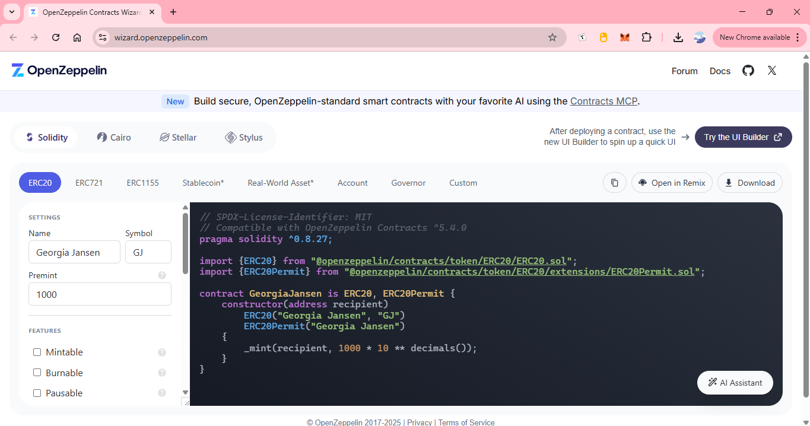
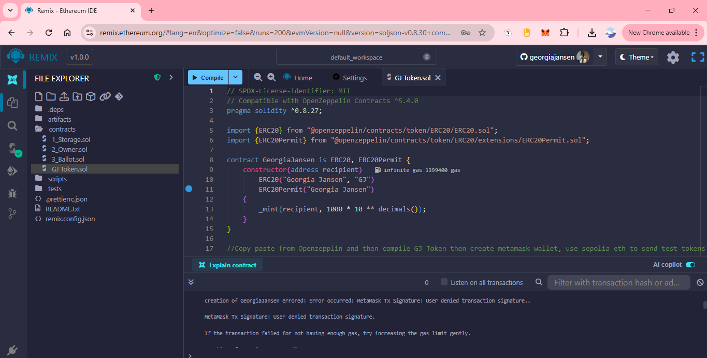
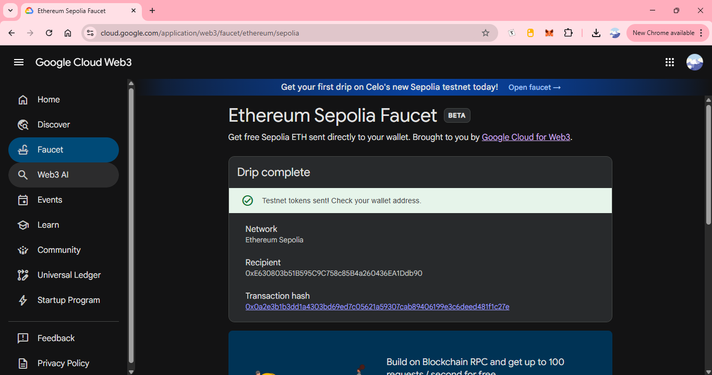
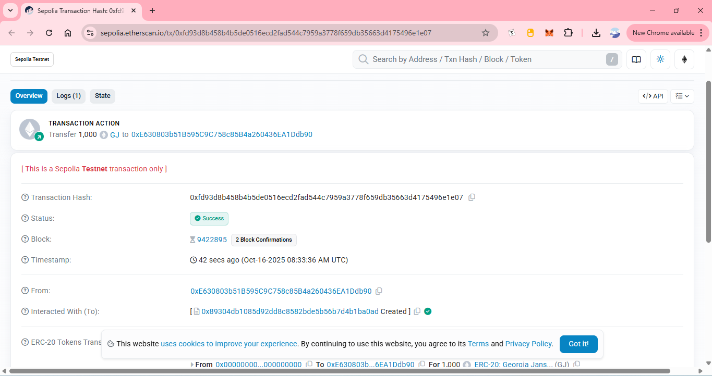

# GJ Token (ERC-20 + Permit) — Sepolia

**Georgia Jansen (GJ)** is an ERC-20 token with **EIP-2612 Permit**, generated with **OpenZeppelin Wizard**, compiled and deployed from **Remix (Injected Provider – MetaMask)** to the **Sepolia** testnet, with a premint of **1,000 GJ** to a recipient address.

- **Network:** Sepolia (chainId 11155111)  
- **Contract address:** `<CONTRACT_ADDRESS>`  
- **Compiler:** Solidity 0.8.27  
- **OpenZeppelin Contracts:** ^5.4.0  
- **Source:** `contracts/GJToken.sol`  
- **Gist (original snippet):** https://gist.github.com/georgiajansen/d8ed5a517bc4b836167d544777ea336c

---

## How this token was created (step-by-step with screenshots)

1. **Generate the token code with OpenZeppelin Wizard**  
   Configuration: **ERC20** + **Permit**, Name `Georgia Jansen`, Symbol `GJ`, Premint `1000`.  
   The generated Solidity contract was copied.
   
   

2. **Paste the code into Remix (Ethereum IDE)**  
   Opened `remix.ethereum.org`, created `contracts/GJToken.sol`, and pasted the OpenZeppelin code.
   
   

3. **Set up MetaMask and connect it to Remix**  
   MetaMask extension was installed, a wallet created, and the network switched to **Sepolia**.  
   In Remix → Deploy & Run → **Environment: Injected Provider – MetaMask** to send transactions via MetaMask.
   
   

4. **Fund the wallet on Sepolia (for gas fees)**  
   The **Google Cloud Web3 — Sepolia Faucet** was used to send test ETH to the wallet.  
   These faucet tokens are test ETH used to pay gas on the Sepolia testnet.
   
   

5. **Compile the contract in Remix**  
   Compiler set to **Solidity 0.8.27**; the project compiled successfully.
   
   

6. **Deploy the token contract to Sepolia**  
   In Remix, the `GeorgiaJansen` contract was selected.  
   - **VALUE:** `0`  
   - **Constructor input (`recipient`):** the MetaMask wallet address (to receive the premint of **1,000 GJ**)  
   Deployment was confirmed in MetaMask.

   

7. **Retrieve the contract address from Etherscan (Sepolia)**  
   The deployment transaction was opened on **sepolia.etherscan.io** and the **Created** contract address was copied.
   
   

8. **Import the token into MetaMask**  
   In MetaMask → **Import tokens**, the contract address from step 7 was pasted.  
   MetaMask auto-filled symbol and decimals; **1,000 GJ** appeared under Sepolia.
   
   

---

## Contract

```solidity
// SPDX-License-Identifier: MIT
// Compatible with OpenZeppelin Contracts ^5.4.0
pragma solidity ^0.8.27;

import {ERC20} from "@openzeppelin/contracts/token/ERC20/ERC20.sol";
import {ERC20Permit} from "@openzeppelin/contracts/token/ERC20/extensions/ERC20Permit.sol";

contract GeorgiaJansen is ERC20, ERC20Permit {
    constructor(address recipient)
        ERC20("Georgia Jansen", "GJ")
        ERC20Permit("Georgia Jansen")
    {
        _mint(recipient, 1000 * 10 ** decimals());
    }
}

