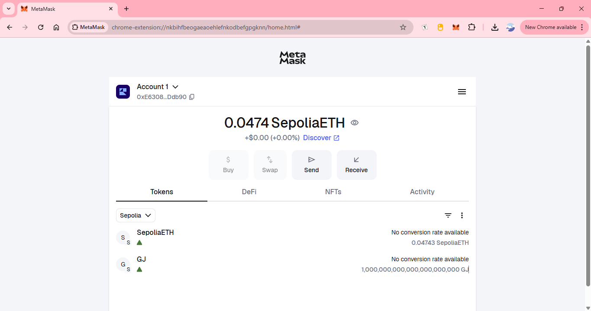

# GJ Token (ERC-20 + Permit) — Sepolia

Simple ERC-20 token named **Georgia Jansen** (`GJ`) with **EIP-2612 Permit** support.
Generated via **OpenZeppelin Wizard**, deployed from **Remix (Injected Provider – MetaMask)** to the **Sepolia** testnet, with a premint of **1,000 GJ** to a recipient address.

> **Contract**
>
> - Network: **Sepolia (chainId 11155111)**
> - Address: **`0x89304db1085d92dd8c8582bde5b56b7d4b1ba0ad`**
> - Compiler: **Solidity 0.8.27**
> - OpenZeppelin Contracts: **^5.4.0**
> - Source: `contracts/GJ Token.sol`
> - Original Gist: https://gist.github.com/georgiajansen/d8ed5a517bc4b836167d544777ea336c

---

## Screenshots

Placed my images in `assets/` (create the folder), then kept these links:

- OpenZeppelin Wizard setup  
  

- MetaMask showing GJ balance  
  

- Google Cloud Sepolia Faucet drip  
  

- Remix editor & compile view  
  

- Etherscan Sepolia transaction (premint transfer)  
  

> File name suggestions (rename your files to match):
> - `assets/oz-wizard.png`
> - `assets/metamask-sepolia.png`
> - `assets/google-cloud-faucet.png`
> - `assets/remix-ide.png`
> - `assets/etherscan-tx.png`

---

## What this token is

- **ERC-20** standard token.
- **EIP-2612 Permit** (`ERC20Permit`) → allows approvals via signatures (gasless approvals).
- **Premint 1,000 GJ** to a recipient provided in the constructor at deploy time:
  ```solidity
  constructor(address recipient)
      ERC20("Georgia Jansen", "GJ")
      ERC20Permit("Georgia Jansen")
  {
      _mint(recipient, 1000 * 10 ** decimals());
  }
